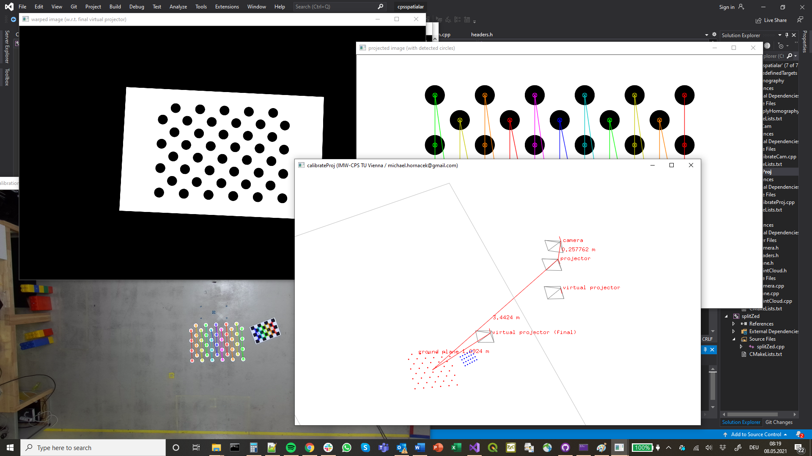

# cpsspatialar

This code implements the approach described in:

Hornacek, M., Küffner-McCauley, H., Trimmel, M., Rupprecht, P., & Schlund, S. (2022). [A spatial AR system for wide-area axis-aligned metric augmentation of planar scenes](https://www.sciencedirect.com/science/article/abs/pii/S1755581722000190?dgcid=author). CIRP Journal of Manufacturing Science and Technology, 37, 219-226

Please cite that paper if you use or build on this code for your own academic work. If you want to use the code commercially, please [contact me](mailto:michael.hornacek@gmail.com).

## Building the Code in Visual Studio 2019

Cf. the last section of the [docs](docs/docs.docx)...

## Sample Invocations

Cf. [here](docs/sample_invocations.txt) for sample invocations of [`splitZed`](src/apps/splitZed) (for splitting images acquired using a [Zed 2 stereo camera](https://www.stereolabs.com/zed-2/) into a left and right frame, respectively), [`calibrateCam`](src/apps/calibrateCam) (for calibrating a single camera or a stereo camera as described in the [docs](docs/docs.pdf)), [`calibrateProj`](src/apps/calibrateProj) (for calibrating a projector and outputting homographies, again as described in the [docs](docs/docs.pdf)), and [`applyHomography`](src/apps/applyHomography) (for warping an image in accordance with such a homography).

Find the corresponding sample images [here](docs/sample_data), to be used for running the sample invocations as of `calibrateCam` (i.e., the images were acquired using a Zed 2 but were split using `splitZed`, with only the images of the left camera pushed to GitHub).

## 3D Viewer of `calibrateProj`

Besides serving to calibrate the projector and compute homographies, `calibrateProj` enables visualizing the geometric setup for a selected input calibration image (indicated using the `visImIdx` argument):

Important keys for navigating the 3D viewer:

* **F1**: align OpenGL's camera (i.e., viewport) pose with currently selected **camera/projector's pose** (selection according to F2)
* **F2**: switch OpenGL's camera projection matrix in accordance with next **camera/projector's intrinsics**; order: (i) camera, (ii) projector, (iii) virtual projector (obtained by getting projector to point downwards to ground plane—precisely in direction of the ground plane's normal vector—by computing minimum arc length rotation about the point where the projector's view direction intersects the ground plane), (iv) final virtual projector (same as virtual projector, but additonally rotated with respect to axes of the camera upon being set to face downwards, and optionally placed lower towards ground plane in accordance with the `verticalNegOffset` argument)
* **F3**: same as F2, but in opposite order
* **F4**: display various **distances** in meters
* **F5**: toggle between **projecting to the ground plane** the (i) center points of the [circles pattern image](https://github.com/m-hornacek/cpsspatialar/blob/main/docs/sample_data/acircles_pattern_960x600.png) and (ii) an optional visualization image (if not provided, defaults to circles pattern image)
* **F6**:  toggle beween projecting the center points or visualization image described for F4 (i) from the [projector](docs/projector.png) or (ii) from the [final virtual projector](docs/final_virtual_projector.png); note that viewing the latter from the viewpoint of the projector has the same effect as the corresponding final homography
* **space bar**: toggle between interpreting mouse movements for controlling the rotational component of OpenGL's camera pose and locking the rotational component of OpenGL's camera pose
* **arrow keys + mouse wheel**: move the camera center of OpenGL's camera pose
* **ESC**: exit
