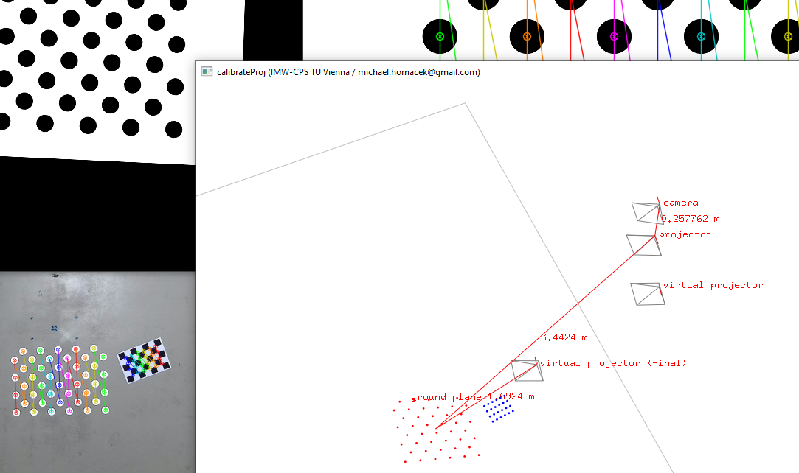

# cpsspatialar

## Building the Code in Visual Studio 2019

Cf. the last section of the [docs](docs/docs.pdf)...

## Sample Invocations

Cf. [here](docs/sample_invocations.txt) for sample invocations of [`splitZed`](src/apps/splitZed) (for splitting images acquired using the [Zed 2 stereo camera](https://www.stereolabs.com/zed-2/) into a left and right frame, respectively), [`calibrateCam`](src/apps/calibrateCam) (for calibrating a single camera or a stereo camera), [`calibrateProj`](src/apps/calibrateProj) (for calibrating a projector and outputting homographies as described in the [docs](docs/docs.pdf)), and [`applyHomography`](src/apps/applyHomography) (for warping an image in accordance with such a homography).

Find the corresponding sample images [here](docs/sample_data), to be used for running the sample invocations as of `calibrateCam`.

## 3D Viewer of `calibrateProj`

Besides serving to calibrate the projector and compute homographies, `calibrateProj` enables visualizing the geometric setup for a selected input calibration image (indicated using the `visImIdx` argument):

Important keys for navigating the 3D viewer:

* **F1**: align OpenGL's camera (i.e., viewport) pose with currently selected **camera/projector's pose** (selection according to F2)
* **F2**: switch OpenGL's camera projection matrix in accordance with next **camera/projector's intrinsics**; order: (i) camera, (ii) projector, (iii) virtual projector (obtained by getting projector to point downwards to ground plane—precisely in direction of the ground plane's normal vector—by computing minimum arc length rotation about the point where the projector's view direction intersects the ground plane), (iv) final virtual projector (virtual projector additonally rotated with respect to axes of the camera and optionally placed lower towards ground plane)
* **F3**: display various **distances** in meters
* **F4**: display center points of the [circles pattern image](https://github.com/m-hornacek/cpsspatialar/blob/main/docs/sample_data/acircles_pattern_960x600.png) as projected to ground plane by (i) projector (**red points**) or by (ii) final virtual projector (**green points**); note that warping the circles pattern image by the corresponding output homography has exactly the intended effect of **viewing the green points from the viewpoint of the original projector** (i.e., such that OpenGL's camera's pose and intrinsics are set, respectively using F1 and F2, in accordance with the pose and intrinsics of the projector)
* **ESC**: exit
